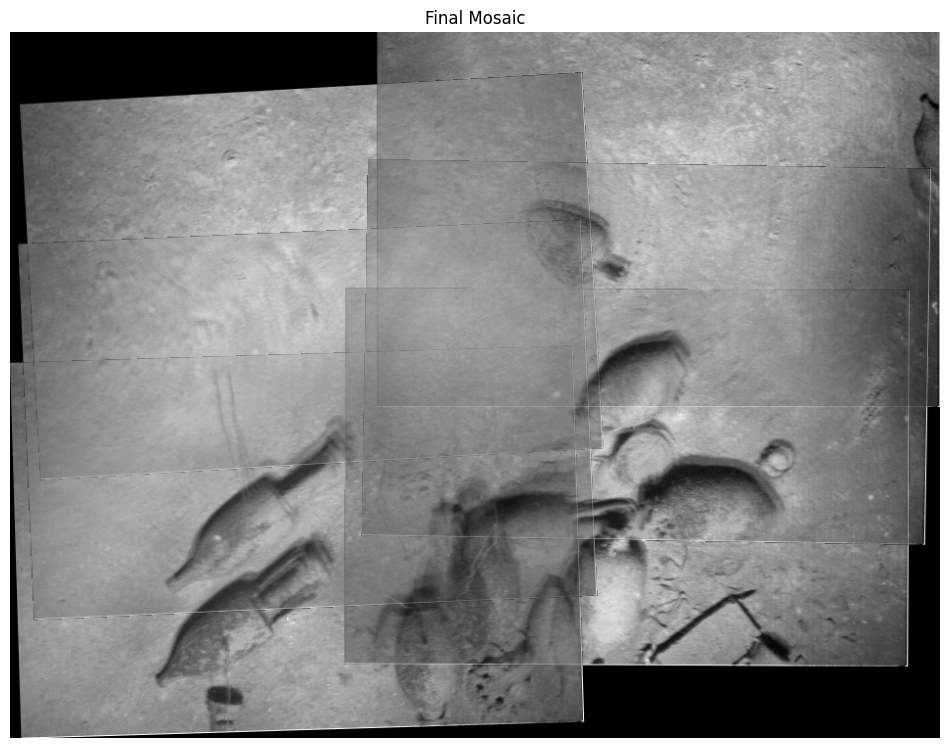
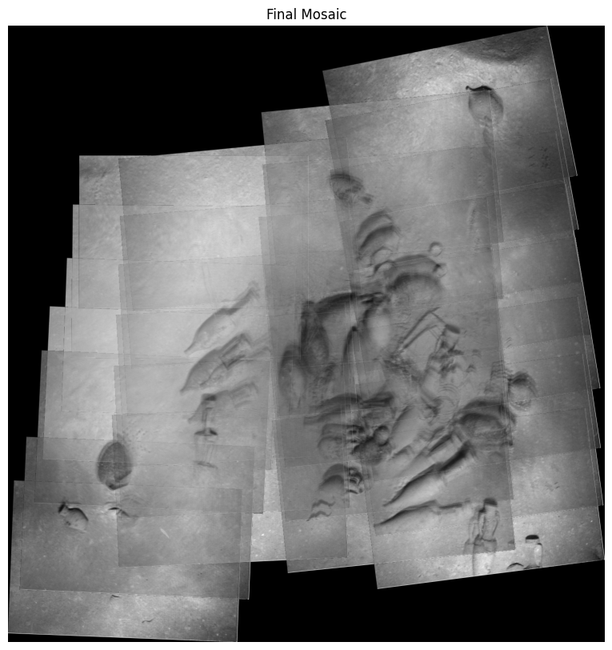

# Underwater Image Registration and Photomosaicing

This project focuses on **underwater image registration** and **photomosaicing** using low-contrast datasets inspired by the work of *Pizarro and Singh (2003)* in _IEEE Journal of Oceanic Engineering_.
It explores robust feature matching, homography estimation, and global alignment techniques to reconstruct large-scale underwater mosaics.

---

## 🌊 Project Overview

Underwater imagery presents unique challenges due to light attenuation, backscatter, low contrast, and visibility limits.
This project implements a complete **image registration and mosaicing pipeline** capable of constructing coherent mosaics from challenging underwater data.

### Key Objectives
- Normalize images for lighting correction.
- Use RANSAC for robust image matching.
- Estimate homographies with Levenberg–Marquardt optimization.
- Build a global factor graph of image relationships.
- Optimize all image poses using **GTSAM**.

---

## 🧠 Dataset

**Skerki Dataset** – Includes imagery of archaeological interest captured near the Roman shipwreck site at Skerki Bank.

Subsets:
- **6-image subset** for testing pairwise registration.
- **29+ images** for full-scale mosaicing.

---

## ⚙️ Implementation Details

- **Language:** Python 3
- **Main Notebook:** `underwater_image_registration.ipynb`
- **Libraries:** OpenCV, NumPy, Matplotlib, SciPy, GTSAM

---

## 📊 Results

- Successfully matched low-contrast underwater images.
- Achieved stable homography estimation even under illumination variation.
- Built globally optimized photomosaics using factor graphs.

### Final Panorama Results

---

## 🧾 Reference Paper

Pizarro, O. & Singh, H. (2003).  
**Toward Large-Area Mosaicing for Underwater Scientific Applications.**  
IEEE Journal of Oceanic Engineering, 28(4), 651–672.

---

## 📘 References
- Pizarro & Singh 2003 – IEEE JOE  
- GTSAM Library  
- OpenCV Documentation  
